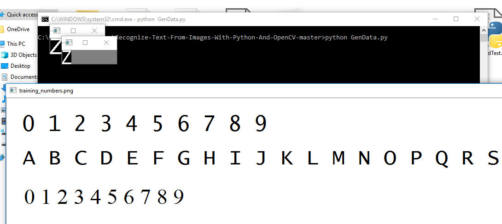
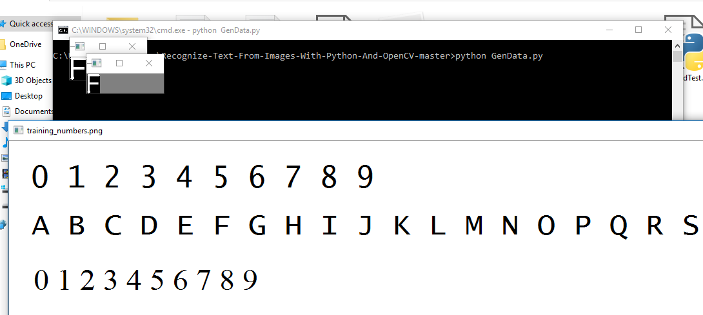
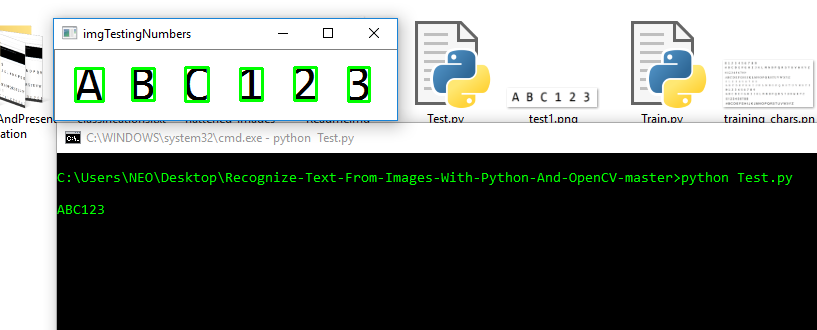
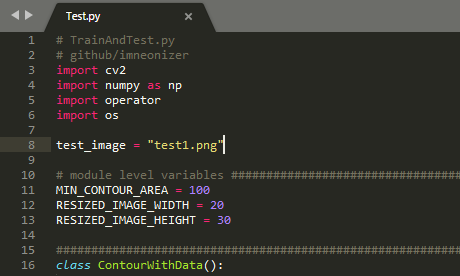
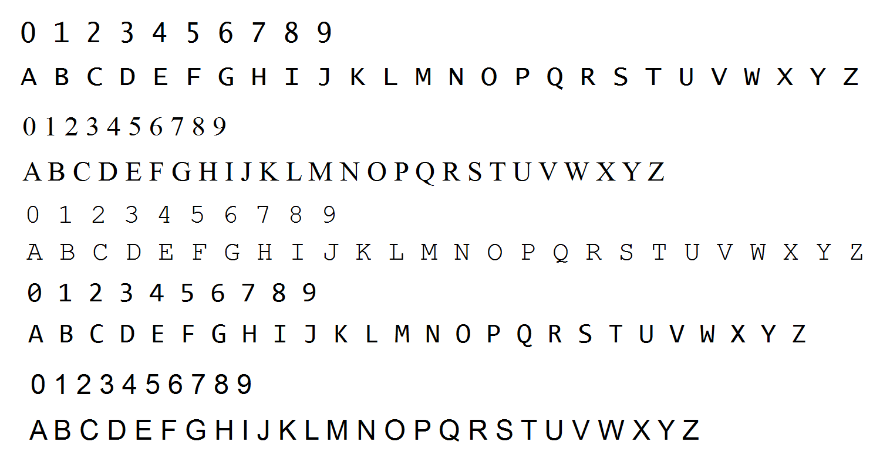
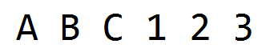
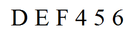
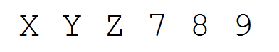
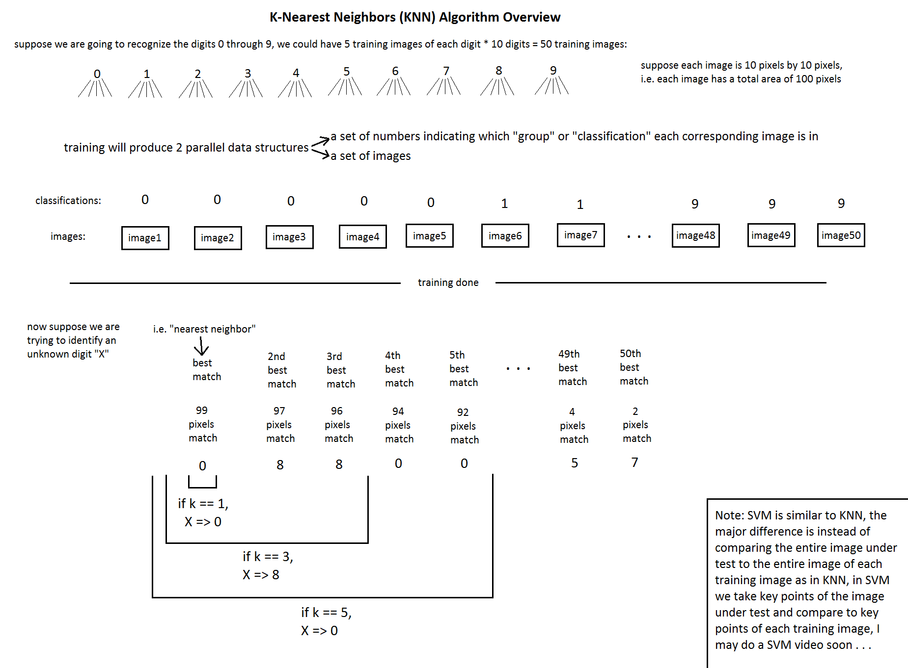

#### Recognize Text from Images with Python and Opencv

You can use this code to Train on Any Font Style of English Alphabets and Numbers, This code is so powerful when it comes to extracting Text From Images. And the best part is you can train the model as per your preference.

````python
>> pip install cv2
>> pip install numpy
````

#### Step: 1

>Run "GenData.py" to Train this K-NN Model
>How to Train?
>Simply When you will Run GenData.py A window will show up Any Alphabet / Number will be highlighted in Green color you need to press that key on your keyboard to tell the Model, which character it is.

#### Step: 2

>After Completion of Training you can run "TrainAndTest.py" to test your first run.
>If you want it to recognize something else you can simply change the "test_image" variable on 8th line in TrainAndTest.py with the path of your desired image.

#### Illustrations

> For Training, Run ``Train.py`` and press the keys (Note:- Keep Caps On), which shows up in the small window.
>
> 
>
> 


> For Testing, Run ``Test.py`` the output will be something similar to below image.
>
> 
>
> 
>
> If you want to test out on different image you can change the input image on`` line 8 `` of the file.
>
> Three different images has been provided for testing purpose.
>
> 


#### Training And Testing Images

> Training Image
>
> 
>
> Test Image 1
>
> 
>
> Test Image 2
>
> 
>
> Test Image 3
>
> 

#### Algorithm used

> KNN Algorithm
>
> 